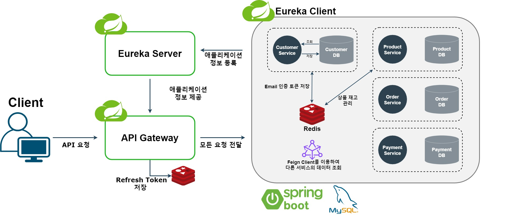

# Yakku MSA 프로젝트

## 프로젝트 개요
- 일반적인 상품 구매 프로세스를 구현하여 기본적인 e-commerce 기능을 제공합니다.
- 특정 시간에 많은 요청이 몰리는 예약 구매 상황에서 필요한 동시성 처리 로직으로 시스템 안정성을 확보 하였습니다.
- 마이크로서비스 아키텍처를 기반으로 서비스를 분리하고, 서비스 간 효율적인 데이터 통신 및 관리 방식을 구현했습니다.
- API Gateway와 Eureka Service Discovery를 통해 마이크로서비스 간의 유연한 통신과 확장성을 확보했습니다.

이 프로젝트를 통해 MSA의 기본 구성 방법을 익히고, 대규모 트래픽 처리, 서비스 간 통신, 데이터 일관성 유지 등 다양한 기술적 과제들을 접해보았습니다.

## 기술 스택
### Backend


### Database


### Etc


## 아키텍처 개요


Yakku 프로젝트는 다음과 같은 주요 서비스로 구성되어 있습니다:
- API Gateway
- Eureka Server (서비스 디스커버리)
- Customer Service
- Product Service
- Order Service
- Payment Service

## 주요 기능
- E-commerce 주요 기능인 상품, 주문, 결제, 위시리스트 기능
- JWT를 사용한 사용자 식별, 로그인 기능
- 대량의 주문 요청시 캐싱과 Redisson 분산 락을 통하여 명확한 재고 처리

## 시작하기
- 현재 구조 개편중으로 실행이 불가합니다. 업데이트 예정
- 임시 실행 방법
  <details>
  <summary>열기</summary>

  [](https://github.com/Jonggae/yakku-eureka)
  [](https://github.com/Jonggae/yakku-APIGateway)
  [](https://github.com/Jonggae/yakku-user-service)
  
  [](https://github.com/Jonggae/yakku-product-service)
  [](https://github.com/Jonggae/yakku-order-service)
  [](https://github.com/Jonggae/yakku-payment-service)
  
  - 분리된 각 Repository에 접근합니다.
  - terminal에서 각 docker-compose를 실행합니다. 
      
    ```docker-compose up -d```
  - 서비스 실행 순서: Eureka Server > API Gateway > 기타 서비스
  - 모든 서비스가 실행된 후, http://localhost:{API_GATEWAY_PORT}/actuator/health 에 접속하여 시스템 상태를 확인할 수 있습니다.
  </details>
## 트러블 슈팅

## 연락처
- 개발자: 최종우 (Choi JongWoo)
- 이메일: muvnelik@naver.com

  [](https://github.com/Jonggae)
  [](https://jonggae.tistory.com/)

