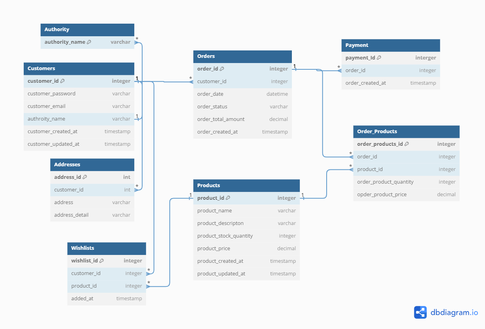

# Yakku MSA 프로젝트
***
## 🚀 프로젝트 개요
- 일반적인 상품 구매 프로세스를 구현하여 기본적인 e-commerce 기능을 제공합니다.
- 특정 시간에 많은 요청이 몰리는 예약 구매 상황에서 필요한 동시성 처리 로직으로 시스템 안정성을 확보 하였습니다.
- 마이크로서비스 아키텍처를 기반으로 서비스를 분리하고, 서비스 간 효율적인 데이터 통신 및 관리 방식을 구현했습니다.
- API Gateway와 Eureka Service Discovery를 통해 마이크로서비스 간의 유연한 통신과 확장성을 확보했습니다.

이 프로젝트를 통해 MSA의 기본 구성 방법을 익히고, 대규모 트래픽 처리, 서비스 간 통신, 데이터 일관성 유지 등 다양한 기술적 과제들을 접해보았습니다.
****
## 🔎 ERD

## 🔧 기술 스택
### 👨‍💻 Backend


### 💿 Database


### 🔎 Etc


***
## 📒 아키텍처 개요

***
## 👨‍💻 프로젝트 주요 서비스
- API Gateway
- Eureka Server (서비스 디스커버리)
- Customer Service
- Product Service
- Order Service
- Payment Service
***
## ✨ 주요 기능
- E-commerce 주요 기능인 상품, 주문, 결제, 위시리스트 기능
- JWT 기반의 사용자 식별, 로그인 기능
- 예약 구매 상황에서 대량의 주문 요청시 캐싱과 Redisson, 분산 락을 통하여 명확한 재고 관리
***
## 🛫 시작하기
- 현재 구조 개편중으로 실행이 불가합니다. 업데이트 예정
  <details>
  <summary> 임시 실행 방법</summary>

  [](https://github.com/Jonggae/yakku-eureka)
  [](https://github.com/Jonggae/yakku-APIGateway)
  [](https://github.com/Jonggae/yakku-user-service)
  
  [](https://github.com/Jonggae/yakku-product-service)
  [](https://github.com/Jonggae/yakku-order-service)
  [](https://github.com/Jonggae/yakku-payment-service)
  
  - 분리된 각 Repository에 접근합니다.
  - terminal에서 각 docker-compose를 실행합니다. 
      
    ```docker-compose up -d```
  - 서비스 실행 순서: Eureka Server > API Gateway > 기타 서비스
  - 모든 서비스가 실행된 후, http://localhost:8761 에 접속하여 시스템 상태를 확인할 수 있습니다.
  </details>
***
## 📶성능 최적화 및 트러블 슈팅
### 트러블 슈팅

#### 1. DTO를 통한 Data 전송 문제
회원 가입 이메일 인증이 완료되었으나 입력한 회원 정보가 제대로 저장되지 않음.

-> DTO를 세분화하여 해결 [자세히 보기](https://jonggae.tistory.com/169)

#### 2. 액세스 토큰의 재발급 문제
올바른 리프레시 토큰이 있는데도 액세스 토큰이 재발급 되지 않음

-> JWT 비밀 키를 하나로 사용하고 있어 발급은 되나 이후 과정에 문제가 발생함.
비밀키를 Refresh, Access token을 분리하여 다시 설정

#### 3. API Gateway

#### 4. Kafka vs Feign Client

### 성능 최적화

1만건의 동시 구매 요청 처리
- Redis로 재고 관리
- 분산 락
- Redisson
- 캐싱
- 락 최적화 등

***
## 📱연락처
- 최종우 (Choi JongWoo)
- muvnelik@naver.com

  [](https://github.com/Jonggae)
  [](https://jonggae.tistory.com/)

